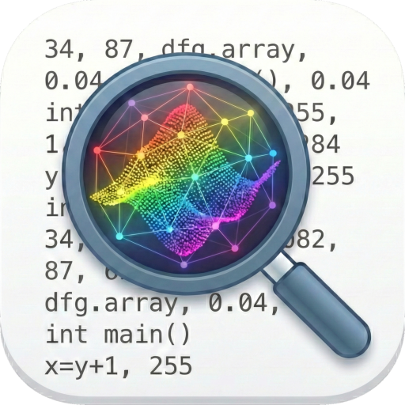

  

<h1 align="center">Python Debug Plotter</h1>

  <strong>Visualize NumPy, PyTorch, and Graphs while debugging — no extra dependencies required.</strong>

  
  
  
  

  
  

## Features

View 2D single and three channel arrays as images, Nx2 and Nx3 arrays as point clouds, networkx graphs as interactive 3D plots and 1D arrays as histograms.

 

You can explore any ND array or tensor by first creating one of the primitives above in the debug console. A Bx3xHxW tensor can be shown by first typing `img = batch[4]` and then plotting the image.

 

The visualization is automatically updated while steping through the code.

 

Compound data that cannot be plotted is printed with rich information. For instance, a list with a torch tensor on the GPU, a dictionary with an array, a tensor and a pillow image and a list of 10 arrays is shown as

## Requirements

- VS Code 1.96.0 or higher
- Python debugger session active

## Usage

1. Start a Python debugging session
2. Set a breakpoint and pause execution
3. In the Variables panel, right-click on a PyTorch tensor, NumPy array, or NetworkX graph
4. Select "Plot variable" from the context menu
5. The data will be visualized in a new panel

## Supported Variable Types

The extension uses a smart heuristic to automatically detect the best visualization for your data.

| **TYPE** | **DETECTION LOGIC** | **SPECIAL NOTES** |
| :--- | :--- | :--- |
| **Histogram** | `ndim == 1` | NaNs and Infs are converted to `0`. |
| **Point Cloud** | `ndim == 2` AND `shape[1]` is `2` or `3` | Supports 2D (XY) and 3D (XYZ) coordinates. |
| **Image** | `ndim == 2` (width ≥ 4) OR `ndim == 3` | Supports Channels First/Last and 1, 3, or 4 channels. |
| **Graph** | Has `.nodes` and `.edges` | Looks for `pos`, `coord`, or `xy` keys for node layout. |
| **PyTorch** | Checks for `detach` and `cpu` attributes | Automatically calls `.detach().cpu().numpy()`. |
| **Generic** | Supports `np.asarray()` or `.numpy()` | Seamlessly handles **Pillow** images and **Tensorflow** tensors. |
| **Text** | Anything else | Fallback to a rich string representation. |

> **Note on Graphs:** If no coordinate information is found in the node data, the extension will attempt to use NetworkX for automatic layout calculation if available in the environment.

## Change Log

See [CHANGELOG.md](./CHANGELOG.md) for full release history.
