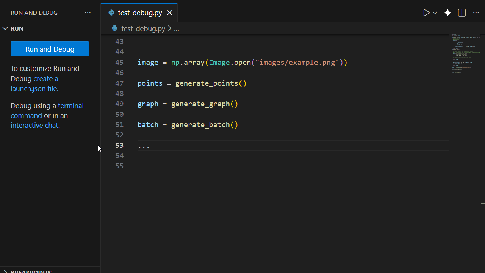
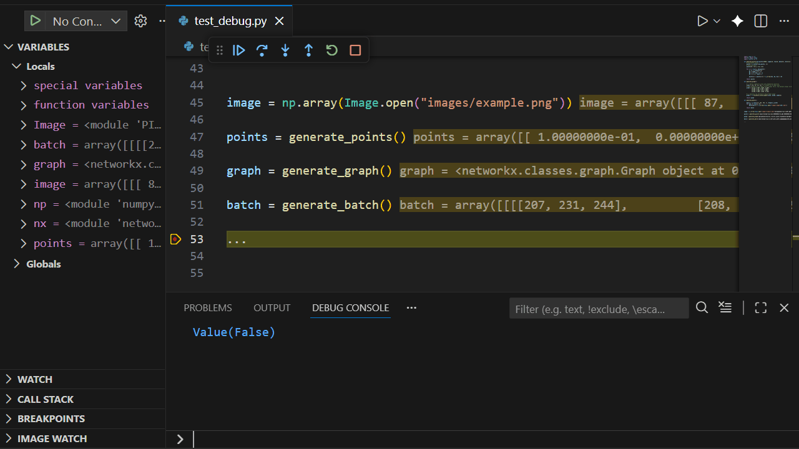
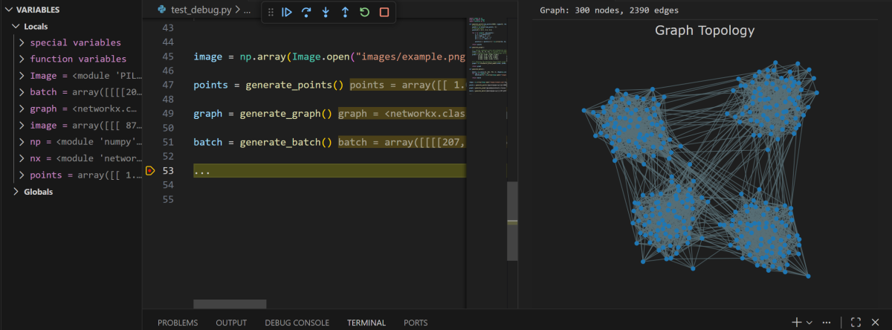

# Simple Data Viewer

A lightweight VS Code extension for visualizing NumPy arrays and PyTorch tensors during Python debugging sessions. It also supports variables that can be converted to a NumPy array (e.g. a list of points) and NetworkX graphs. Networkx, Pytorch or other dependencies are not required!

## Features

View 2D and multichannel Pytorch and numpy arrays in the debugger. Right-click on a variable and select "View variable"


<br>

View 2D and 3D point clouds



<br>

You can explore any tensor or array. For instance, an image in a Bx3xHxW array can be shown by first defining the variable in the debug console (img = batch[7]). The variable can then be viewed as an image



<br>

The extension also support viewing Networkx graphs




## Requirements

- VS Code 1.107.0 or higher
- Python debugger session active

## Installation

1. Download simple-data-viewer-x.vsix from the (release)[release] folder.

2. In the Extensions VSCode panel, click on the three dots on the upper right corner and then on "Install from VSIX".

## Usage

1. Start a Python debugging session
2. Set a breakpoint and pause execution
3. In the Variables panel, right-click on a PyTorch tensor, NumPy array, or NetworkX graph
4. Select "View variable" from the context menu
5. The data will be visualized in a new panel

## Supported Variable Types

The full heuristic for automatically detecting and handling point clouds and images is as follows:

```python
# Detection of PyTorch Tensor-like object (can be on GPU and on computation graph)
if hasattr(variable, 'cpu') and hasattr(variable, 'detach'):
    variable = variable.detach().cpu().numpy()

# Conversion of variable to numpy array
try:
    np_array = np.asarray(variable)
...

ndim = np_array.ndim
shape = np_array.shape

# Point cloud detection
if ndim == 2 and shape[1] in [2, 3]:
    if shape[1] == 2:
        type = "points"
    elif shape[1] == 3:
        type = "points3d"

# Image handling
elif ndim == 2 or ndim == 3:
    # Insert channel dimension if ndim == 2
    # ...

    C, H, W = np_array.shape
    # Heuristic to detect if channel is first
    if C in [1, 3, 4] and H > 4 and W > 4:
        np_array = np.transpose(np_array, (1, 2, 0)) 

    # If integer with range outside [0, 255], the array requires normalization
    if np_array.dtype.kind == 'i' and (np_array.max() > 255 or np_array.min() < 0):
        np_array = np_array.astype(np.float32)

    # If float, normalize to [0, 255]
    if np_array.dtype.kind == 'f':
        ...
```

## Future plans

- Visualize 1D array as histogram

## Release Notes

### 0.0.1

Initial release of Simple Data Viewer

- View PyTorch tensors during debugging
- View NumPy arrays during debugging
- View NetworkX graphs during debugging
- Right-click context menu in Variables panel

